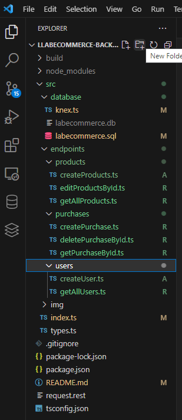

# Labecommerce


### Meu primeiro projeto backend, proposto no curso de desenvolvimento Full Stack da Labenu. Nesse projeto foi aplicado a base de criação de uma API vincunlada ao um banco de dados.

# Índice
* [Layout](#layout-do-projeto)
* [Requisições (Paths)](#requisições)
* [Exemplo de Requisições](#exemplo-de-requisições)
* [Documentação Postman](#documentação-postman)
* [Tecnologias](#tecnoligias)
* [Acesso ao Projeto](#acesso-ao-projeto)
* [Desenvolvedor(a)](#Desenvolvedor(a))


# Layout

* Estrutura das pastas



# Requisiçoes (Paths)

### Requisições de Usuários

* /users

### Requisições de Produtos

* /products

### Requisições de Compras

* /purchases


# Exemplo de Requisições
### Requisições de usuários


* `GET /users`: Retorna todos usuários.
```json
[
  {
    "id": "a005",
    "name": "Regiane",
    "email": "regiane@email.com",
    "password": "12345",
    "created_at": "2023-06-19"
  },
  {
    "id": "a010",
    "name": "Elvis",
    "email": "elvis@email.com",
    "password": "45678",
    "created_at": "2023-06-19"
  },
  {
    "id": "a015",
    "name": "Miguel",
    "email": "miguel@email.com",
    "password": "56748",
    "created_at": "2023-06-19"
  }
]
```

* `POST /users`: Cadastra um novo usuário.

```json
{
  "message": "Cadastro realizado com sucesso!"
}
```

### Requisições de produtos
* `GET /products`: Retorna todos os produtos.
```json
[
  {
    "id": "p003",
    "name": "Iphone",
    "price": 2000,
    "description": "13 Pro",
    "image_url": "a pesquisar"
  },
  {
    "id": "p006",
    "name": "Nike",
    "price": 400,
    "description": "Air Force",
    "image_url": "a pesquisar"
  },
  {
    "id": "p010",
    "name": "Xbox",
    "price": 1600,
    "description": "Series S",
    "image_url": "a pesquisar"
  },
  {
    "id": "p0021",
    "name": "Lg",
    "price": 3000,
    "description": "Tv 50'",
    "image_url": "a pesquisar"
  },
  {
    "id": "p016",
    "name": "Nike",
    "price": 390,
    "description": "Jordan",
    "image_url": "a pesquisar"
  }
]
```
* `POST /products`: Cadastra um novo produto.
```json
{
  "message": "Produto cadastrado com sucesso!"
}
```
* `PUT /products/:id`: Edita produtos pelo o Id.
```json
{
  "message": "Produto atualizado com sucesso"
}
```

### Requisições de compras
* `POST /purchases`: Cria um pedido de compra.
```json
{
  "message": "Pedido realizado com sucesso."
}
```
* `DELETE /purchases/:id`: Deleta uma compra pelo Id.

```json
{
  "message": "Pedido cancelado com sucesso!"
}
```
* `GET /purchases/:id`: Busca compra pelo Id.
```json
{
  "purchaseId": "c028",
  "purchaseBuyer": "a010",
  "buyerName": "Elvis",
  "buyerEmail": "elvis@email.com",
  "total_price": 4800,
  "created_at": "2023-07-11 17:51:03",
  "products": [
    {
      "productId": "p006",
      "name": "Nike",
      "price": 400,
      "description": "Air Force",
      "image_url": "a pesquisar",
      "quantity": 4
    },
    {
      "productId": "p010",
      "name": "Xbox",
      "price": 1600,
      "description": "Series S",
      "image_url": "a pesquisar",
      "quantity": 2
    }
  ]
}
```


# Documentação do Postman

https://documenter.getpostman.com/view/26567220/2s946cguHZ

# 🛠 Tecnologias

Na construção do projeto foram usadas as seguintes ferramentas:

- [Node.js](https://nodejs.org/en/)
- [TypeScript](https://www.typescriptlang.org/)
- [Express](https://expressjs.com/pt-br/)
- [SQL](https://learn.microsoft.com/pt-br/sql/?view=sql-server-ver16)
- [SQLite](https://www.sqlite.org/docs.html)
- [Knex.js](https://knexjs.org/guide/)


# Acesso ao Projeto

### Pré Requisitos

Antes de começar, você vai precisar ter instalado em sua máquina as seguintes ferramentas:
[Git](https://git-scm.com), [Node.js](https://nodejs.org/en/). 
Além disto é bom ter um editor para trabalhar com o código como [VSCode](https://code.visualstudio.com/)

### 🎲 Rodando o Back End (servidor)

```bash
# Clone este repositório
$ git clone <https://github.com/Regiane-Martins/llabecommerce-backend.git>

# Instale as dependências
$ npm install

# Execute a aplicação em modo de desenvolvimento
$ npm run dev:server

# O servidor inciará na porta:3003 - acesse <http://localhost:3003>
```

# Desenvolvedor(a)


 <br />
 <sub style="font-size: 18px"><b>Regiane Martins</b></sub></a>
 <div>
 <br/>
<a href="https://www.linkedin.com/in/regiane-martins-henrique-6399ba65" target="_blank"></a> 
</div>


